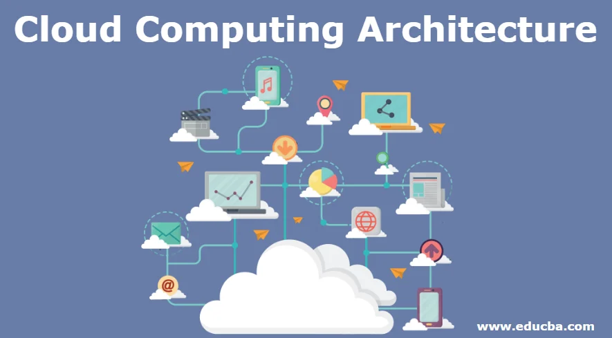
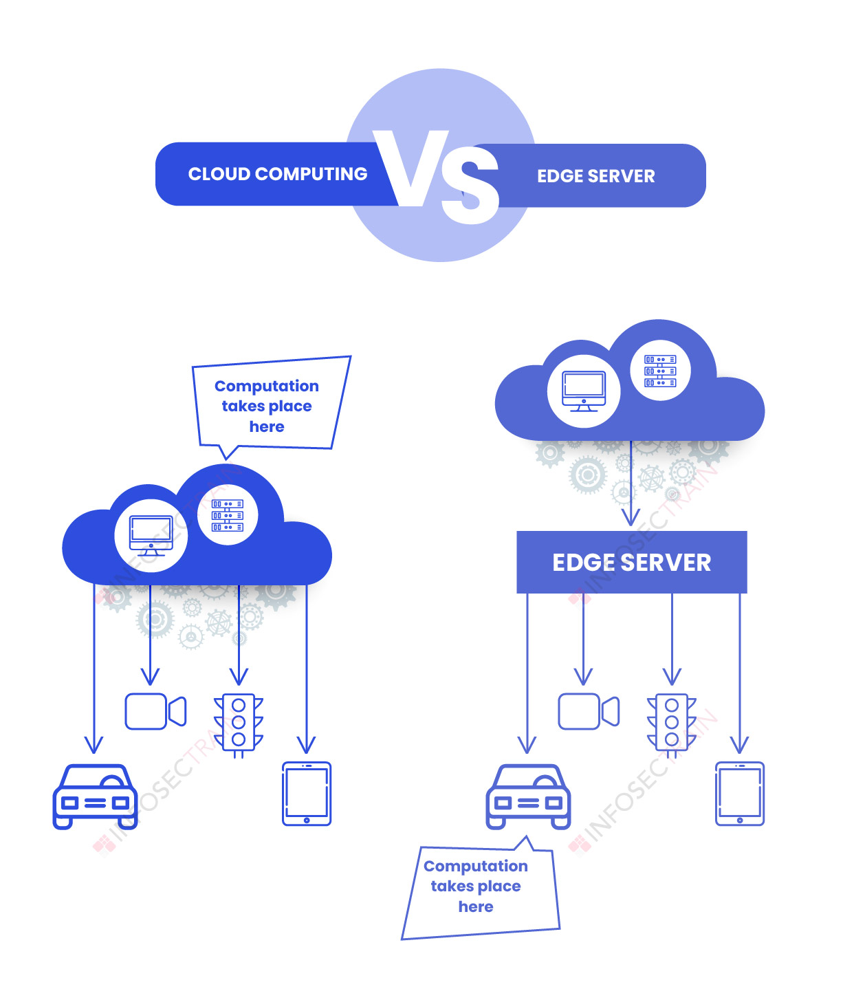

# UD 03: Sistemas Cloud - El Continuo Computacional

Este proyecto recoge la documentación técnica sobre la evolución de los sistemas de computación, desde el almacenamiento centralizado en la nube (**Cloud**) hasta el procesamiento en el extremo de la red (**Edge**).

## 1. Introducción: La Transformación Digital
La migración a la nube no es solo una opción tecnológica, sino una **necesidad estratégica**. Permite a las organizaciones:
* **Visión 360º del cliente**: Unificar datos para un conocimiento profundo.
* **Optimización de operaciones**: Mejora logística y reducción de stock.
* **Agilidad**: Respuesta rápida ante mercados cambiantes.

---

## 2. Cloud Computing: Poder Centralizado

El *Cloud Computing* ofrece una alternativa rentable a la infraestructura local (*on-premise*).

### Beneficios Principales
1. **Reducción de Costes**: Se elimina la inversión inicial en hardware y se reduce el gasto energético.
2. **Innovación Constante**: Acceso inmediato a actualizaciones y nuevas tecnologías.
3. **Escalabilidad**: Capacidad de ampliar o reducir recursos según la demanda real.
4. **Seguridad**: Protección de datos gestionada por expertos.

### Modelos de Servicio
La nube se divide en diferentes niveles de responsabilidad:
* **IaaS (Infraestructura)**: Alquiler de servidores y redes.
* **PaaS (Plataforma)**: Entorno para que los desarrolladores creen aplicaciones.
* **SaaS (Software)**: Aplicaciones listas para usar (ej. Gmail, Office 365).
* **CaaS (Contenedores)**: Gestión de aplicaciones mediante contenedores.

---

## 3. El Desafío del IoT y la Latencia

Con el auge del *Internet de las Cosas* (IoT), miles de millones de dispositivos generan datos masivos. Esto provoca:
* **Saturación de banda**: Demasiada información viajando por la red.
* **Latencia**: El retraso en el tiempo de respuesta, crítico en situaciones de emergencia.

---

## 4. Edge Computing: Procesamiento en la Periferia

El **Edge Computing** consiste en procesar los datos lo más cerca posible de donde se generan. 

### Ventajas del Edge:
- **Inmediatez**: Decisiones en milisegundos.
- **Privacidad**: Los datos sensibles no abandonan el perímetro local.
- **Eficiencia**: Solo se envía a la nube la información estrictamente necesaria.

### Ejemplos de Uso
- **Vehículos Autónomos**: Deben frenar o esquivar obstáculos sin esperar respuesta de un servidor lejano.
- **Edge AI**: Reconocimiento facial en smartphones (el proceso ocurre en el chip del teléfono).
- **Ciudades Inteligentes**: Gestión de semáforos en tiempo real.

---

## 5. Resumen: Cloud vs. Edge

Ambas tecnologías son **complementarias**. Mientras que el Cloud es ideal para el análisis masivo de datos históricos, el Edge es vital para la acción inmediata.

| Característica | Cloud Computing | Edge Computing |
| :--- | :--- | :--- |
| **Tiempo de respuesta** | Lento (Latencia alta) | Instantáneo (Latencia baja) |
| **Lugar de proceso** | Centros de datos remotos | Dispositivos locales |
| **Escalabilidad** | Muy alta | Limitada al hardware local |
| **Uso de red** | Alto consumo de banda | Bajo consumo de banda |

---

## Recursos de Markdown Utilizados
Para la correcta visualización de este archivo, se recomienda consultar:
* [Documentación Oficial de GitHub - Basic Syntax](https://docs.github.com/en/get-started/writing-on-github/getting-started-with-writing-and-formatting-on-github/basic-writing-and-formatting-syntax)
* [Markdown Cheat Sheet (Español)](https://markdowncheatsheet.net/es)
* [Markdown Guide](https://www.markdownguide.org/cheat-sheet/)

---
*Documentación creada para la asignatura de Tecnologías Habilitadoras Digitales.*