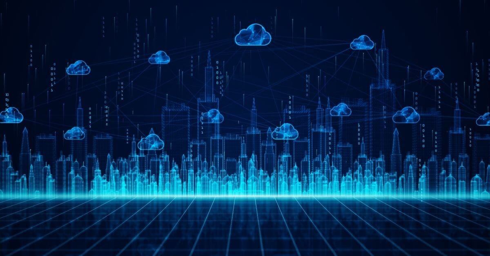
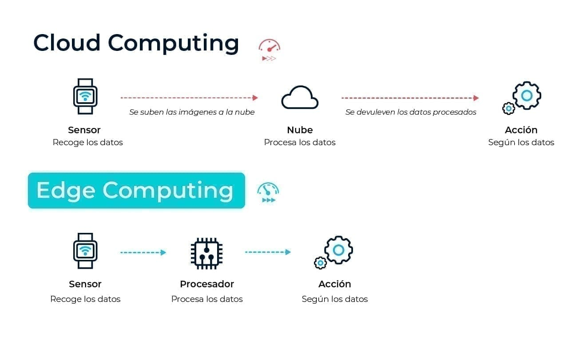

# ☁️ UDI 03: Sistemas Cloud y el Continuo Computacional (Cloud-Edge)

> **Asignatura:** Digitalització aplicada al sistema productiu
> **Unidad Didáctica:** 03 - Sistemas Cloud

---

## 1. Introducción: La Estrategia de la Nube

La adopción de la nube (**Cloud Computing**) ha dejado de ser una tendencia para convertirse en el pilar de la **transformación digital** de cualquier empresa moderna. No se trata solo de mover servidores, sino de una reestructuración estratégica que permite:

*   **Conocimiento 360º del Cliente:** Al unificar los datos en un entorno centralizado, se obtiene una visión completa para personalizar servicios y ofertas.
*   **Eficiencia Operacional:** Optimización de la cadena de suministro, reducción de inventario y mejora en la logística gracias al análisis de datos a gran escala.
*   **Flexibilidad y Agilidad:** Capacidad de adaptación rápida a las fluctuaciones del mercado y de lanzar nuevos productos o servicios en tiempo récord.

---

## 2. Cloud Computing: El Cerebro Centralizado

El Cloud Computing es el modelo que permite el acceso bajo demanda a recursos informáticos (servidores, almacenamiento, bases de datos, software) a través de Internet, con un pago por uso.

### 2.1. Ventajas Clave

1.  **Ahorro de Costes (CAPEX a OPEX):** Se elimina la necesidad de grandes inversiones iniciales en hardware (Gasto de Capital - CAPEX), pasando a un modelo de gasto operativo (OPEX) más predecible y escalable.
2.  **Innovación Continua:** Las plataformas en la nube se actualizan constantemente, dando acceso inmediato a las últimas tecnologías (Inteligencia Artificial, Machine Learning, etc.) sin esfuerzo de mantenimiento local.
3.  **Escalabilidad Elástica:** La capacidad de aumentar o disminuir los recursos de forma automática y casi instantánea en función de la demanda real.
4.  **Seguridad Gestionada:** Los proveedores invierten miles de millones en seguridad física y lógica, ofreciendo un nivel de protección que pocas empresas podrían replicar por sí mismas.

### 2.2. Modelos de Servicio (La Pila de la Nube)

La responsabilidad de la gestión se comparte entre el proveedor y el cliente, definiendo los siguientes modelos:

| Modelo | Descripción | Responsabilidad del Cliente | Ejemplo |
| :--- | :--- | :--- | :--- |
| **IaaS** (Infraestructura como Servicio) | Se alquilan los componentes básicos: servidores, redes, almacenamiento. | Sistema Operativo, Aplicaciones, Datos. | AWS EC2, Azure VMs |
| **PaaS** (Plataforma como Servicio) | Se proporciona un entorno completo para desarrollar, ejecutar y gestionar aplicaciones. | Aplicaciones, Datos. | Google App Engine, Heroku |
| **SaaS** (Software como Servicio) | El software está listo para usar a través de un navegador web. | Ninguna (solo el uso y los datos). | Gmail, Office 365, Salesforce |
| **CaaS** (Contenedores como Servicio) | Un modelo intermedio que facilita el despliegue y gestión de aplicaciones en contenedores (Docker, Kubernetes). | Configuración del Contenedor, Aplicaciones, Datos. | AWS EKS, Google GKE |

---

## 3. El Desafío de la Latencia y el IoT

El crecimiento exponencial del **Internet de las Cosas (IoT)**, con miles de millones de dispositivos conectados (sensores, cámaras, vehículos), ha puesto en jaque el modelo de Cloud centralizado.

Los problemas principales son:

*   **Saturación de Ancho de Banda:** Enviar *todos* los datos generados por el IoT a la nube es ineficiente y costoso.
*   **Latencia Crítica:** El tiempo de ida y vuelta de los datos al centro de datos remoto es demasiado lento para aplicaciones que requieren una respuesta en tiempo real (ej. cirugía robótica, vehículos autónomos).

---

## 4. Edge Computing: La Inteligencia Descentralizada

El **Edge Computing** es la solución a la latencia, llevando la capacidad de procesamiento y almacenamiento de datos al **extremo de la red**, es decir, lo más cerca posible de la fuente de datos (el dispositivo IoT).

### 4.1. Beneficios Estratégicos del Edge

*   **Inmediatez (Latencia Cero):** Las decisiones se toman en milisegundos en el propio dispositivo o en un servidor local (gateway), lo cual es vital para la seguridad y la automatización.
*   **Privacidad y Soberanía del Dato:** Los datos sensibles pueden ser procesados y anonimizados localmente, sin necesidad de ser transmitidos a la nube, cumpliendo con regulaciones como el GDPR.
*   **Optimización de Red:** Se reduce drásticamente la cantidad de datos que se envían a la nube, enviando solo los resultados del análisis o los datos agregados.

### 4.2. Casos de Uso Reales

*   **Vehículos Autónomos:** El coche debe procesar la información de sus sensores (cámaras, radar) y decidir si frena o gira *al instante*, sin depender de una conexión remota.
*   **Fábricas Inteligentes (Industria 4.0):** Monitorización y control de maquinaria en tiempo real para detectar fallos o realizar ajustes de precisión.
*   **Edge AI:** La ejecución de modelos de Inteligencia Artificial (ej. reconocimiento facial o de voz) directamente en el chip del smartphone o en una cámara de seguridad.

---

## 5. Conclusión: Cloud y Edge, una Relación Complementaria

El Cloud y el Edge no son tecnologías rivales, sino **socios indispensables** en el continuo computacional.

| Característica | Cloud Computing | Edge Computing |
| :--- | :--- | :--- |
| **Propósito Principal** | Análisis de Big Data, almacenamiento histórico, desarrollo de modelos de IA. | Acción inmediata, baja latencia, filtrado de datos. |
| **Ubicación del Proceso** | Centros de datos remotos (Centralizado). | Dispositivos o gateways locales (Descentralizado). |
| **Latencia** | Alta (segundos o cientos de milisegundos). | Muy baja (milisegundos). |
| **Ancho de Banda** | Alto consumo (se envían todos los datos). | Bajo consumo (se envían solo los resultados). |

El futuro pasa por una arquitectura híbrida donde el **Edge** se encarga de la acción rápida y el **Cloud** de la inteligencia a largo plazo.

---

## 🛠️ Requisitos de Formato (Markdown)

Este documento ha sido formateado siguiendo las directrices de la Unidad Didáctica, utilizando los siguientes elementos de Markdown:

*   **Título Principal y Subtítulos:** Uso de `#` y `##` para una estructura clara.
*   **Énfasis:** Uso de `**negrita**` y `*cursiva*` para destacar conceptos clave.
*   **Listas:** Uso de listas ordenadas (`1.`) y desordenadas (`*` o `-`).
*   **Tablas:** Uso de la sintaxis de tablas para comparar conceptos (Cloud vs. Edge).
*   **Bloques de Código/Citas:** Uso de `>` para la cita de la asignatura.
*   **Separadores:** Uso de `---` para dividir secciones.

### Recursos Obligatorios Consultados

Para asegurar el correcto formato y sintaxis de este archivo, se han consultado los siguientes recursos:

*   [Documentación Oficial de GitHub - Basic Syntax][1]
*   [Markdown Cheat Sheet (Español)][2]
*   [Markdown Guide - Cheat Sheet][3]

[1]: https://docs.github.com/en/get-started/writing-on-github/getting-started-with-writing-and-formatting-on-github/basic-writing-and-formatting-syntax "Documentación Oficial de GitHub sobre Markdown"
[2]: https://markdowncheatsheet.net/es "Markdown Cheat Sheet (Español)"
[3]: https://www.markdownguide.org/cheat-sheet/ "Markdown Guide - Cheat Sheet"

---
*UD 03 Sistemas Cloud.*
